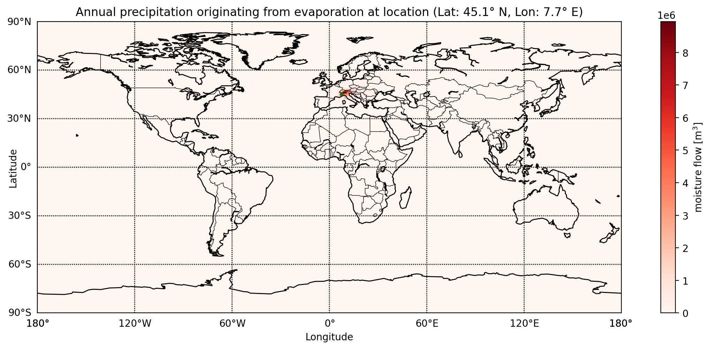
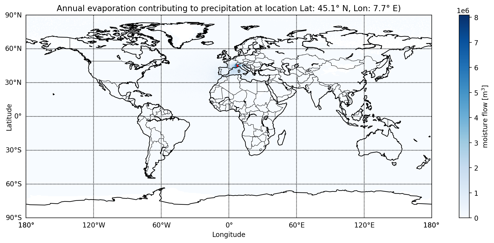
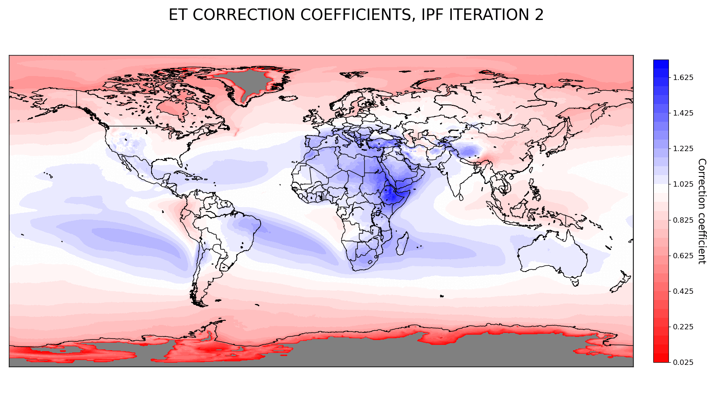
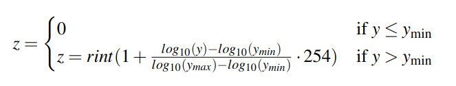

# RECON Moisture Flows Dataset  


Dataset:  [10.5281/zenodo.14191919](https://doi.org/10.5281/zenodo.14191919)

How to cite: [De Petrillo, E., Monaco, L., Tuninetti, M., Staal, A., & Laio, F. (2025). Cell-scale atmospheric moisture flows dataset reconciled with ERA5 reanalysis. Scientific data, 12(1), 629.](https://doi.org/10.1038/s41597-025-04964-3)

---

This repository provides a usage tutorial for the **RECON dataset**, a global atmospheric moisture connections NetCDF dataset. The RECON dataset is a post-processed version of the Lagrangian (forward trajectory-based) tracking model **UTrack** dataset (DOI UTrack dataset: [10.1594/PANGAEA.912710](https://doi.pangaea.de/10.1594/PANGAEA.912710), DOI UTrack support paper: [10.5194/essd-12-3177-2020](https://doi.org/10.5194/essd-12-3177-2020)).


## Data Overview  

The **RECON dataset** provides moisture flow volumes, in cubic meters, from evaporation sources to precipitation targets and vice versa. It offers global coverage at a resolution of 0.5° for an average year based on the period **2008–2017**.
The RECON dataset is available at [10.5281/zenodo.14191919](https://doi.org/10.5281/zenodo.14191919) in a compressed .7z format, along with a data download and treatment guide. Instead, this repository provides basic Python scripts to retrieve moisture flow volumes from sources of evaporation to targets of precipitation.  

---

## Data Handling  

- The dataset supports the retrieval of **source-to-target** and **target-to-source sheds** using a 4-tuple of coordinates `(source_lat, source_lon, target_lat, target_lon)`:  
  - **Latitudes (lats)** are in the range `[90, -90]`.  
  - **Longitudes (lons)** are in the range `[0, 360]`.

- To retrieve **evaporation sheds** (downwind region receiving precipitation) from an evapotranspiration point, users must specify the **source coordinates**. Conversely, to retrieve **precipitation sheds** (upwind region contributing to precipitation), users must specify the **target coordinates**.

- **Data Format**: Moisture flow volumes in the dataset are stored as integers `[0, 255]` and must be converted to cubic meters.  The data conversion formula
    
    $y = 10^{\frac{z-1}{254}\cdot[log_{10}(y_{max})-log_{10}(y_{min})]+log_{10}(y_{min})}$

    is included in the scripts described in the next section. $y$ is the converted volume in $m^3$, $z$ is the volume retrieved from RECON, $y_{max}\approx 122079329\ m^3$ is the maximum volume in $m^3$ contained in RECON and $y_{min}=10^{-3}\ m^3$ is the minimum threshold we chose to considering a moisture volume.

---

## Repository contents

  - `example_scripts\`:
    - `Rec_evaporation_shed.ipynb` : This notebook retrieves and plots the reconciled moisture flows originating precipitation in a downwind area from the source of interest based on the RECON NetCDF data.
    - `Rec_precipitation_shed.ipynb`:  This notebook retrieves and plots the reconciled moisture flows contributing to precipitation at the sink of interest from upwind evaporation sources based on the RECON NetCDF data.
  - `requirements.txt`: The dependencies include essential Python libraries needed to run the provided scripts. Versions are specified as used by the authors, but they're not mandatory. You can install them with `pip install -r requirements.txt`

---

## Downloading and extracting the dataset

The file `RECON_moisture_flows_0.5.nc.7z` is a compressed/packed version
of the NetCDF4 RECON dataset. To get the NetCDF dataset file, you can
use a general-purpose unpacking software such as
[WinRar](https://www.win-rar.com/download.html) in Windows, or the `7z`
tool in Linux.

### Instructions for Ubuntu

Here are the steps to download and unpack the `.7z` dataset in Ubuntu via terminal:

Before we start, go to the location where you want to store the dataset, for example  `/home/user/Downloads`.

#### Downloading

For the version 2, the URL of the dataset is `https://zenodo.org/records/15025813/files/RECON_moisture_flows_0.5.nc.7z`, update this URL in the command if you want to download another version.

Download the packed `RECON_moisture_flows_0.5.nc.7z` file with wget:

```bash
wget https://zenodo.org/records/15025813/files/RECON_moisture_flows_0.5.nc.7z
```

#### Unpacking

If p7zip is not already installed, install it with:

``` bash
sudo apt install p7zip
```

Unpack RECON with the following command:

``` bash
7z x RECON_moisture_flows_0.5.nc.7z
```

---

## How to use the notebooks

1. **Set Up the Environment**:  
  Ensure you have a Python environment with the required packages as specified in `requirements.txt`.

2. **Run the notebooks**:  
  Use the notebooks to retrieve and analyze reconciled moisture flows. You can specify either source or target coordinates based on whether you want precipitation or evapotranspiration sheds.

3. **Visualization**:  
  The notebooks also generate plots that visualize global moisture flows, focusing on evaporation-to-precipitation or precipitation-to-evaporation pathways.

---

## Example of visualizations

### Evaporation shed map



### Precipiration shed map



---

## Data generation process

1. **Monthly Averages**:  
   We calculated the monthly averaged (2008–2017) moisture flow volumes from the **UTrack dataset**, using a customized version of ERA5 monthly average data.
   In this preprocessing step, we ensured that:
     - Negative evapotranspiration values were set to zero.
     - The global hydrological cycle was balanced, ensuring global evapotranspiration equals global precipitation.  

2. **Yearly Averages**:  
   The monthly averaged moisture flows were integrated to obtain yearly averages.  

3. **Reconciliation**:  
   - The yearly averaged moisture flows were reconciled with our processed version of ERA5 yearly average data.  
   - This reconciliation was performed using the Iterative Proportional Fitting (IPF) method to ensure consistency.  
   Here follows an animated gif showing the IPF correction coefficient at every iteration at global scale
   
4. **Data conversion**:
   To ensure continuity with the Utrack dataset data format and reduce the RECON dataset weight, we converted the moisture volumes into integer values `[0, 255]` using the following formula
   
   

   where $z$ is the RECON integer converted volume, $rint$ is the nearest integer convertion function, $y$ is the initial volume in $m^3$, $y_{max}\approx 122079329\ m^3$ is the maximum volume in $m^3$ contained in RECON and $y_{min}=10^{-3}\ m^3$ is the minimum threshold we chose to considering a moisture volume.
 
   
[Elena De Petrillo](https://orcid.org/0000-0001-7398-5742) elena.depetrillo@polito.it  
[Luca Monaco](https://orcid.org/0000-0001-7701-5954) luca.monaco@cimafoundation.org  
[Romain Thomas](https://orcid.org/0009-0008-9900-1930)
